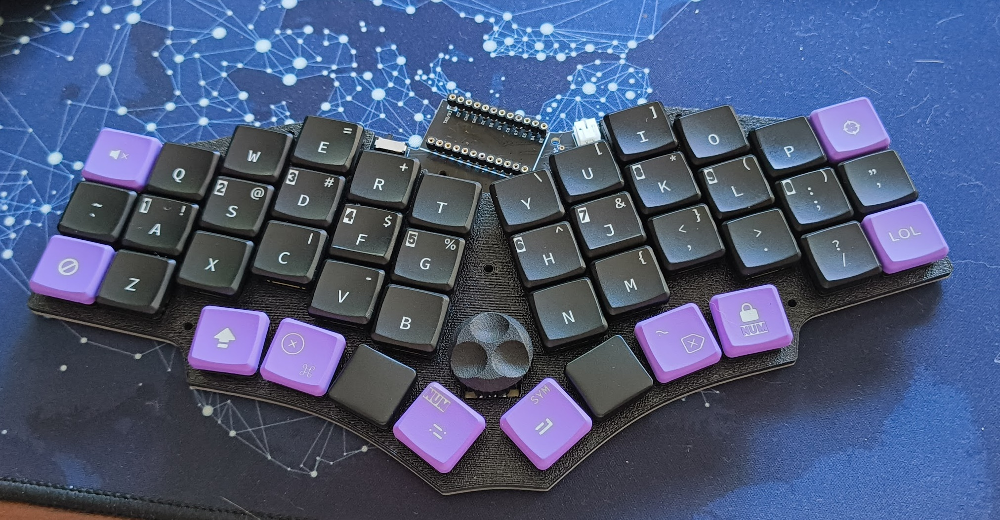

# Chocorang44

Chocorang is a fork Chocotako44 (Choctopus44) and features a case redesign and updated ZMK config.

Optimised for ultra low profile form factor including magnetic case cover and larger battery.

## Todo

### ZMK

- [x] Basic layer functionality based on KLORista
- [ ] delete
- [ ] LOL layer
- [ ] Wasd (on dscf) layer
- [ ] Mute and Cancle keys
- [ ] Double tap repeats key
- [ ] CAPS LED
- [ ] POWER LED
- [ ] Layer LED ??

### Case
- [ ] Bottom case
- [ ] Rubber feet inslits
- [ ] Reset hole
- [ ] Battery mounts
- [ ] Magnet gaps
- [ ] Top lid
